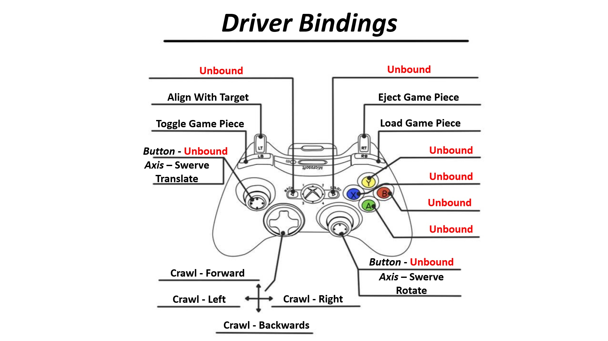
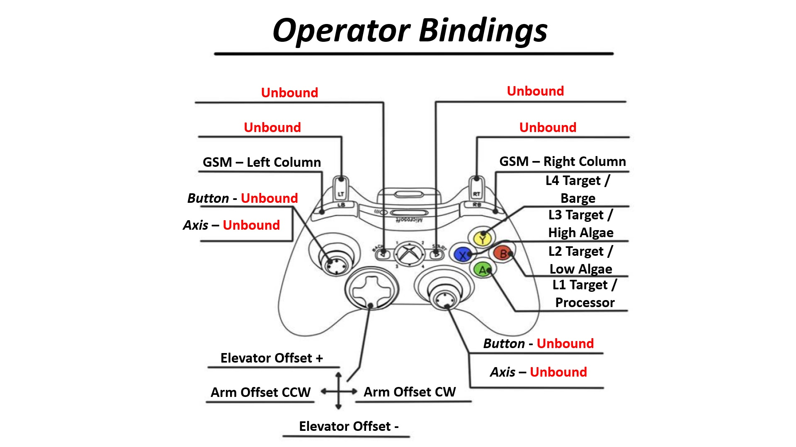

# 2025 REEFSCAPE Robot Code
This code is intended to run on both the 4143 and 4423 robots for the 2025 Season. You can see more about how each robot is configured in the [Robot Configs](#robot-configs) section.

## Controller Bindings

## Robot Configs
Each Robot has constants that are specific to its design. During construction and upgrades the robot measurements and systems deviated. Some of the major differences are in this table
| Measurement | 4143 | 4423 |
| ----------- | ---- | ---- |
| Left Module Types | MK4N | MK4I |
| Drive Gearing | L3+ | L3 |
| Vision | Slam | Photon |
| Climber | *Present* | *Missing* |
| Coral Pickup | *Present* | *Missing* |

The entire config can be seen in the config files
- [4143 Beta Bot Config](/src/main/deploy/robots/BetaBot.json)
- [4423 Alpha Bot Config](/src/main/deploy/robots/AlphaBot.json)
